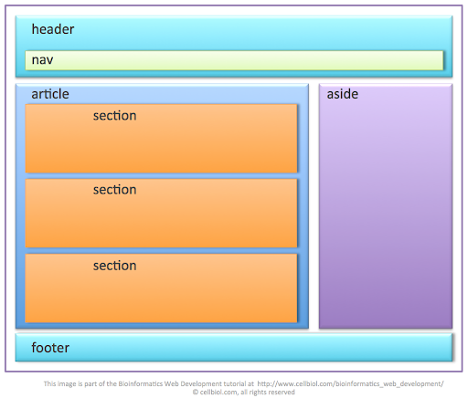

## How Websites Are Created ?

All websites use **HTML** and **CSS**, but content 
management systems, blogging software, and e-commerce platforms often add a few more technologies into the mix.Small websites are often written just using HTML and CSS.Larger websites — in particular those that are updated regularly and use a content management system (CMS), blogging tools, or e-commerce software — often make use of more complex technologies on the web server, but these technologies are actually used to produce HTML and CSS that is then sent to the browser. So, if your site uses these technologies, you will be able to use your new HTML and CSS knowledge to take more control over how your site looks.

## How the Web Works ?
When you visit a website, the web server 
hosting that site could be anywhere in the 
world. In order for you to find the location of 
the web server, your browser will first connect 
to a Domain Name System (DNS) server.

# HTML

in this article will know for **What**, **Why** and **How** using HTML .

HTML is hypertext markup language , structure of web pages and add content and info to webpage by using tags

The HTML code is made up of characters that live inside angled brackets — these are called HTML *** Element *** .Elements are usually made up of two ***tags***: an opening tag and a closing tag. (The closing tag has an extra forward slash in it.) Each HTML element tells the browser something about the information that sits between its opening and closing tags. 

- Attributes provide additional information 
about the contents of an element. They appear 
on the opening tag of the element and are 
made up of two parts: a name and a value, 
separated by an equals sign.

- Because there have been 
several versions of HTML, each 
web page should begin with a 
DOCTYPE declaration to tell a 
browser which version of HTML 
the page is using (although 
browsers usually display the 
page even if it is not included). 
We will therefore be including 
one in each example for the rest 
of the book. 

- For a long time, web page authors used 
 elements to group  together related elements on the page  Authors used class or id attributes to indicate the role of the 
 element in the structure of the page after that HTML5 introduces a new set of elements that allow you to divide up the parts of a page. The names of these elements indicate the kind of content you will find in them. They are still subject to change, but that has not stopped many web page authors using them already .for example : <nav> and <article> 
  
  ## ARTICALE 
  The article element acts as a container for any section of a page that could stand alone and potentially be syndicated. This could be an individual article or blog entry, a comment or forum post, or any other independent piece of content.
  
  ## SECTION
  The section element groups related content together, and typically each section would have its own heading.For example, on a homepage there may be several section
elements to contain different sections of the page, such as latest news, top products, and newsletter signup.
  
  