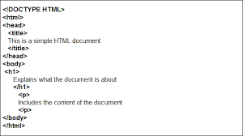
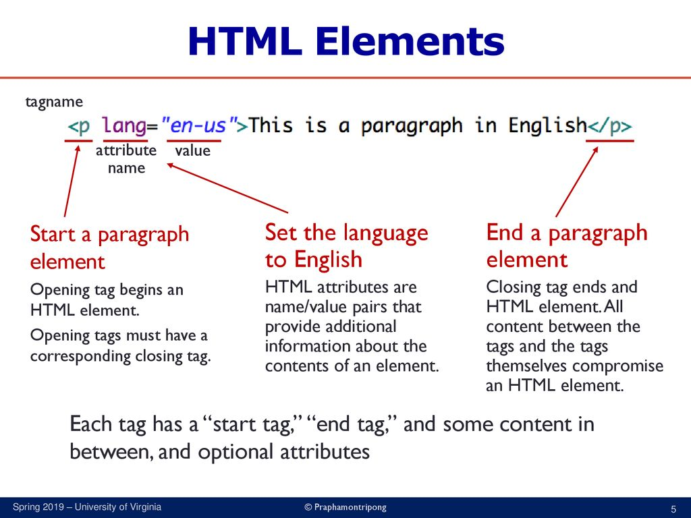
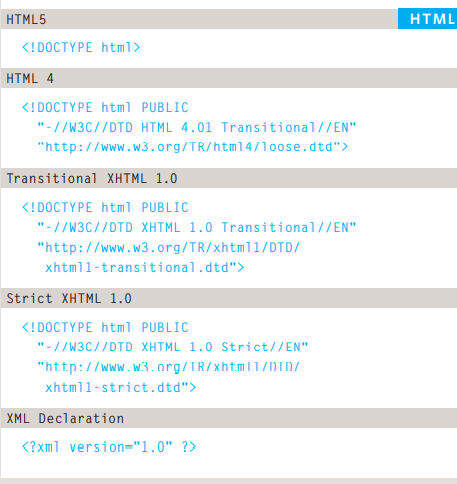

## How People Access the Web ?

- Browsers
- Web Servers
- Screen readers
- Devices

## How Websites Are Created ?

All websites use **HTML** and **CSS**, but content 
management systems, blogging software, and e-commerce platforms often add a few more technologies into the mix.Small websites are often written just using HTML and CSS.Larger websites — in particular those that are updated regularly and use a content management system (CMS), blogging tools, or e-commerce software — often make use of more complex technologies on the web server, but these technologies are actually used to produce HTML and CSS that is then sent to the browser. So, if your site uses these technologies, you will be able to use your new HTML and CSS knowledge to take more control over how your site looks.

## How the Web Works ?
When you visit a website, the web server 
hosting that site could be anywhere in the 
world. In order for you to find the location of 
the web server, your browser will first connect 
to a Domain Name System (DNS) server.

# HTML

in this article will know for **What**, **Why** and **How** using HTML .

HTML is hypertext markup language , structure of web pages and add content and info to webpage by using tags

The HTML code is made up of characters that live inside angled brackets — these are called HTML *** Element *** .Elements are usually made up of two ***tags***: an opening tag and a closing tag. (The closing tag has an extra forward slash in it.) Each HTML element tells the browser something about the information that sits between its opening and closing tags. 

- Attributes provide additional information 
about the contents of an element. They appear 
on the opening tag of the element and are 
made up of two parts: a name and a value, 
separated by an equals sign.

- Because there have been 
several versions of HTML, each 
web page should begin with a 
DOCTYPE declaration to tell a 
browser which version of HTML 
the page is using (although 
browsers usually display the 
page even if it is not included). 
We will therefore be including 
one in each example for the rest 
of the book. 

- For a long time, web page authors used 
 elements to group  together related elements on the page  Authors used class or id attributes to indicate the role of the 
 element in the structure of the page after that HTML5 introduces a new set of elements that allow you to divide up the parts of a page. The names of these elements indicate the kind of content you will find in them. They are still subject to change, but that has not stopped many web page authors using them already .for example : <nav> and <article> 
  
  ## ARTICALE 
  The article element acts as a container for any section of a page that could stand alone and potentially be syndicated. This could be an individual article or blog entry, a comment or forum post, or any other independent piece of content.
  
  ## SECTION
  The section element groups related content together, and typically each section would have its own heading.For example, on a homepage there may be several section
elements to contain different sections of the page, such as latest news, top products, and newsletter signup.
  
  

  ### Body, Head & Title

  **body** :You met the <body> element 
in the first example we created. 
Everything inside this element is 
shown inside the main browser 
window.

**Head** :Before the <body> element you 
will often see a <head> element. 
This contains information 
about the page (rather than 
information that is shown within 
the main part of the browser 
window that is highlighted in 
blue on the opposite page). 
You will usually find a < title >
element inside the < head >
element

**title** :
The contents of the < title >
element are either shown in the 
top of the browser, above where 
you usually type in the URL of 
the page you want to visit, or 
on the tab for that page (if your 
browser uses tabs to allow you 
to view multiple pages at the 
same time).

### Extra Markup

**DOCTYPEs** : Because there have been 
several versions of HTML, each 
web page should begin with a 
DOCTYPE declaration to tell a 
browser which version of HTML 
the page is using (although 
browsers usually display the 
page even if it is not included). 
We will therefore be including 
one in each example for the rest 
of the book. 

**Comments in HTML** : f you want to add a comment 
to your code that will not be 
visible in the user's browser, you 
can add the text between these 
characters:
<!-- comment goes here -->

**ID Attribute**:Every HTML element can carry 
the id attribute. It is used to 
uniquely identify that element 
from other elements on the 
page. Its value should start with 
a letter or an underscore (not a 
number or any other character).
It is important that no two 
elements on the same page 
have the same value for their id
attributes (otherwise the value is 
no longer unique)

***Class Attribute*** :Every HTML element can 
also carry a class attribute. 
Sometimes, rather than uniquely 
identifying one element within 
a document, you will want a 
way to identify several elements 
as being different from the 
other elements on the page. 
For example, you might have 
some paragraphs of text that 
contain information that is more 
important than others and want 
to distinguish these elements, or 
you might want to differentiate 
between links that point to other 
pages on your own site and links 
that point to external sites. 

### HTML5 Layout

HTML5 is introducing a new set of 
elements that help define the structure of 
a page

- *Traditional HTML Layouts* : For a long time, web page authors used 
 elements to group 
together related elements on the page (such as the elements that form a header, an article, footer or sidebar). Authors used class or id attributes to indicate the role of the 
 element in the structure of the page

*New Html5 Layout Elements* :HTML5 introduces a new set of elements that allow you to divide up the 
parts of a page. The names of these elements indicate the kind of content 
you will find in them. They are still subject to change, but that has not 
stopped many web page authors using them already.

The `<header>` and `<footer>`
elements can be used for:
- The main header or footer 
that appears at the top or 
bottom of every page on the 
site.
- A header or footer for an 
individual article or 
section within the page and to put list.

## NAVIGATION `<nav>` 

The `<nav>` element is used to contain the major navigational blocks on the site such as the 
primary site navigation.At the time of writing, some of the developers that were already using HTML5 decided to use the < nav > element for the links that appear at the bottom of every page (links to things like privacy policy, terms and conditions and accessibility information). Whether this will be widely adopted is still yet to be seen.

### Articles `<article>`

The < article > element acts as a container for any section of a page that could stand alone and potentially be syndicated.This could be an individual article or blog entry, a comment or forum post, or any other independent piece of content

### Sections `<section>`

The< section > element groups related content together, and typically each section would have its own heading.For example, on a homepage there may be several < section >elements to contain different sections of the page, such as latest news, top products, and newsletter signup.

### Sectioning Elements `
`

It may seem strange to follow these new elements by revisiting the < div > element again. (After all, the new elements are often going to be used in its place.)However, the < div > element will remain an important way to group together related elements,because you should not be using these new elements that you have just met for purposes other than those explicitly stated.

#### Wireframe

 is a simple sketch of the key information that needs to go on each page of a site. It shows the hierarchy of the information and how much space it might require.

 

 ## JAVASCRIPT
 
 **A script** is a series of instructions that computer can follow to achieve a goal. Start with the big picture of what you want to achieve, and break that down into smaller steps. 
 

 **HOW A BROWSER SEES A WEB PAGE**
 In order to understand how you can change the content of an HTML page using JavaScript, you need to know how a browser interprets the HTML code and applies styling to it.
 - RECEIVE A PAGE AS HTML CODE 
 -  CREATE A MODEL OF THE PAGE AND STORE IT IN MEMORY
 - : USE A RENDERING ENGINE TO SHOW THE PAGE ON SCREEN 