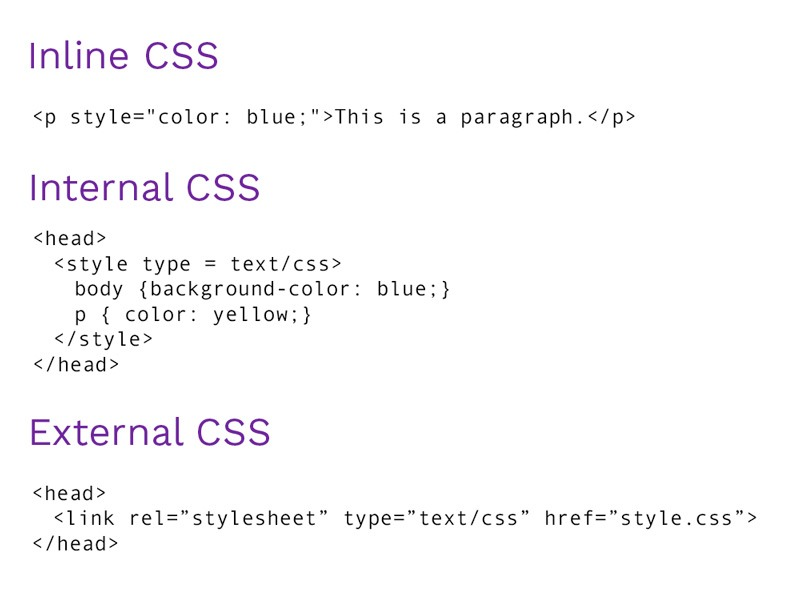

# Text

When creating a web page, you add tags 
(known as markup) to the contents of the 
page. These tags provide extra meaning 
and allow browsers to show users the 
appropriate structure for the page.

How to add markup to the text that 
appears on your pages ?

-  **Structural markup**: the elements that you can use to 
describe both headings and paragraphs and   , 
 ,whitespace and 

- **Semantic markup**: which provides extra information; such 
as where emphasis is placed in a sentence, that something 
you have written is a quotation (and who said it), the 
meaning of acronyms, and so on for example :<strong>
,<em>,<cite> and <dfn>

# css

**What is CSS ?**

CSS allows you to create rules that specify how the content of 
an element should appear. For example, you can specify that 
the background of the page is cream, all paragraphs should 
appear in gray using the Arial typeface, or that all level one 
headings should be in a blue, italic, Times typeface.

CSS works by associating rules with HTML elements. These rules govern 
how the content of specified elements should be displayed. A CSS rule 
contains two parts: a selector and a declaration.

CSS declarations sit inside curly brackets and each is made up of two 
parts: a property and a value, separated by a colon. You can specify 
several properties in one declaration, each separated by a semi-colon. For example:

h1, h2, h3 {

font-family: Arial;

 color: yellow;}

- **Using External CSS**

body {
 font-family: arial;

 background-color: rgb(185,179,175);}

 - **Using Internal CSS**
- **Using inline CSS**

## Basic JavaScript Instructions 

- **STATEMENTS**
A script is a series of instructions that a computer can follow one-by-one. Each individual instruction or step is known as a statement. Statements should end with a semicolon. 

var today= new Date{); 

var hourNow = today.getHours{) ; 

var greeting;

- **COMMENTS**
You should write comments to explain what your code does. 
They help make your code easier to read and understand. 
This can help you and others who read your code

### Decisions and Loops

DECISIONS :Using the results of evaluations, you can decide which path your script should go down. 

Loops :There are also many occasions where you will want to perform the same set of steps repeatedly.

**CONDITIONAL STATEMENTS**

If (score>)50 {

    document.write("you are passed");
} elese { document.write ("try again..");

}