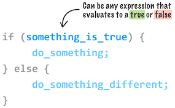

# lists

**Types of lists:**

- *Ordered lists* : are lists where each item in the list is 
numbered. For example, the list might be a set of steps for 
a recipe that must be performed in order, or a legal contract 
where each point needs to be identified by a section 
number.

 - *Unordered lists* : are lists that begin with a bullet point (rather than characters that indicate order).

 -  *Definition lists* :are made up of a set of terms along with the definitions for each of those terms.

 

# Boxes

## Limiting Width

 **min-width, max-width**

 Some page designs expand and 
shrink to fit the size of the user's screen. In such designs, the min-width property specifies the smallest size a box can be displayed at when the browser window is narrow, and the max-width property indicates the maximum width a box can stretch to when the browser window is wide.

## Limiting Height

**min-height, max-height**

In the same way that you might 
want to limit the width of a box on a page, you may also want to limit the height of it. This is achieved using the min-height and max-height properties.

**border-width**

The border-width property is used to control the width of a border. The value of this property can either be given in pixels or using one of the following values: border-top-width
border-right-width
border-bottom-width
border-left-width
 
 

**border-style**

contian more than one types such as:
p.one {border-style: solid;}
p.two {border-style: dotted;}
p.three {border-style: dashed;}
p.four {border-style: double;}
p.five {border-style: groove;}
p.six {border-style: ridge;}
p.seven {border-style: inset;}
p.eight {border-style: outset;}

**border-color**
You can specify the color of a 
border using either RGB values, 
hex codes or CSS color names 
border-top-color
border-right-color
border-bottom-color
border-left-color

## PADDING

The padding property allows you to specify how much space should appear between the content of an element and its 
border. The value of this property is most often specified in pixels (although it is also possible to use percentages or ems). If a percentage is used, the padding is a percentage of the browser window (or of the containing

- Types of padding in CSS:
padding-top
padding-right
padding-bottom
padding-left

### MARGIN

The margin property controls 
the gap between boxes. Its value is commonly given in pixels, although you may also use percentages or ems.
If one box sits on top of another, margins are collapsed , which means the larger of the two margins will be used and the smaller will be disregarded.

This example for margin in CSS:
p {
width: 200px;
border: 2px solid #0088dd;
padding: 10px;}
p.example {
margin: 20px;

**border-image**

The border-image property 
applies an image to the border of 
any box. It takes a background 
image and slices it into nine 
pieces. 
Here is the image. I have 
added marks where it is 
sliced in the example, 
taking 18 pixels from each corner 
to place an entire circle in each 
corner. The corner slices are 
always placed in the four corners 
of the box, but we have a choice 
whether the sides are stretched 
or repeated.

This property requires three 
pieces of information:
1: The URL of the image 
2: Where to slice the image
3: What to do with the straight 
edges; the possible values are:
 stretch stretches the image
 repeat repeats the image
 round like repeat but if the 
tiles do not fit exactly, scales 
the tile image so they will
The box must also have a border 
width for the image to be shown.

## Javascript Instructions

### ARRAYS

An array is a special type of variable. It doesn't just store one value; it stores a list of values You should consider using an array whenever you are working with a list or a set of values that are related to each other. 

You create an array and give it 
a name just like you would any 
other variable (using the var 
keyword followed by the name of 
the array). 
The values are assigned to the 
array inside a pair of square 
brackets, and each value is 
separated by a comma. The 
values in the array do not need 
to be the same data type, so you 
can store a string, a number and 
a Boolean all in the same array. 

**VALUE ES IN ARRAYS**

- *NUMBERING ITEMS IN 
AN ARRAY* :Each item in an array is automatically given a number 
called an index. This can be used to access specific items in the array. Consider the following array which holds three colors: 
var col ors; 
colors= ['whi te ' , 
'black ' , 
' custom ']; 

- *ACCESSING ITEMS IN 
AN ARRAY* :To retrieve the third item on the 
list, the array name is specified 
along with the index number in 
square brackets. 
Here you can see a variable 
called i temThree is declared. 
Its value is set to be the third 
color from the co 1 ors array

## Decisions and Loops

`<If>` : esestatement allows you to provide two sets of code: 
 one set if the condition evaluates to true and another set if the condition is false

 

 ## SWITCH STATEMENTS

 A switch statement starts with a variable called the switch value. Each case indicates a possible value for this variable and the 
code that should run if the 
variable matches that value. 

### TRUTHY & FALSY VALUES

- **Falsy values**:  are treated as if they 
are fa 1 se. The table to the left 
shows a hi ghScore variable with 
a series of values, all of which 
are falsy. 

- **Truthy values**: are treated as if 
they are true. Almost everything 
that is not in the falsy table can 
be treated as if it were true.

## LOOPS

*FOR* :A for loop is often used to loop through the items in an array and The total number of items in the array is stored in avariable called arrayl ength. This 
number is obtained using the 
l ength property of the array. . 

*While* :This loop will continue to run 
for as long as the condition in the parentheses is true. That condition is a counter indicating that, as long as the variable i remains less than 10, the statements in the subsequent code block should run.
