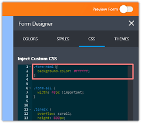

# Images

**why you might want to add an image to a web page ?**
There are several things to consider when selecting and preparing images for your site, but taking time to get them right will make it look more attractive and professional.

**How we can add image in html ?**

To add an image into the page you need to use an< img >element. This is an empty element (which means there is no closing tag). It must carry the following two attributes:

- ***src:*** 
This tells the browser where it can find the image file. This will usually be a relative URL 
pointing to an image on your own site. 

- **alt:**
This provides a text description of the image which describes the image if you cannot see it.

- **title:**
You can also use the title
attribute with the < img > element 
to provide additional information 
about the image .

Also, we can change width and lenght the image inside the same code add image , Images often take longer to load than the HTML code that makes up the rest of the page. 
It is, therefore, a good idea to specify the size of the image so that the browser can render the rest of the text on the page while leaving the right amount of space for the image that is still loading.

### Where to Place Images in Your Code ?

1.**before a paragraph:**
The paragraph starts on a new line after the image.
2. **inside the start of paragraph:**
The first row of text aligns with the bottom of the image.
3.**In the middle of a paragraph:**
The image is placed between the 
words of the paragraph that it appears in.

in the past and in Old Codeit was Aligning 
Images Horizontally or  Vertically just!!

If you need to creating image you will need three rules :
- Save images in the right format
- Save images at 
the right size
- Use the correct resolution.

## Colors

The color property allows you to specify the color of text inside an element. You can specify any color in CSS in one of three ways:
***rgb values:***
These express colors in terms of how much red, green and blue are used to make it up. For example: rgb(100,100,90)

***hex codes:***
These are six-digit codes that represent the amount of red, green and blue in a color, preceded by a pound or hash # sign. For example: #ee3e80

***color names***
There are 147 predefined color names that are recognized by browsers. For example: DarkCyan.

## Background-Color :
You can specify your choice of background color in the same three ways you can specify foreground colors: RGB values, hex codes, and color names .

To read more about Background-Color click [here!](https://www.w3schools.com/cssref/pr_background-color.asp)

### OPACITY

The CSS3 rgba property allows you to specify a color, just like you would with an RGB value, but adds a fourth value to indicate opacity. This value is known as an alpha value and is a number between 0.0 and 1.0(so a value of 0.5 is 50% opacity and 0.15 is 15% opacity). 

**THIS codes examples for color**
body {
 background-color: silver;
 color: white;
 padding: 20px;
 font-family: Arial, Verdana, sans-serif;}
 h1 {
 background-color: #ffffff;
 background-color: hsla(0,100%,100%,0.5);
 color: #64645A;
 padding: inherit;}

 ## Text

 The properties that allow you to control 
the appearance of text can be split into 
two groups:
- Those that directly affect the font and its appearance 
(including the typeface, whether it is regular, bold or italic, 
and the size of the text)
- Those that would have the same effect on text no matter .

**Typeface Terminology** :
-  *Serif*
Serif fonts have extra details on the ends of the main strokes of the letters. Thesedetails are known as serifs.
In print, serif fonts were traditionally used for long passages of text because they were considered easier to read.
- *Sans-Serif*
Sans-serif fonts have straight 
ends to letters, and therefore 
have a much cleaner design.
Screens have a lower resolution 
than print. So, if the text is small, 
sans-serif fonts can be clearer 
to read.
- *Monospace*
Every letter in a monospace (or fixed-width) font is the same width (Non-monospace fonts have different widths.)

**Weight** :
1.`<Light>`
2.`<Medium>`
3.`<Bold>`
4. `<Black>`

**Style** :
1. `<Normal>`
2.`< Italic >`
3.`< Oblique >`

 **Stretch** :
1. `<Condensed>`
2. `<Regular>`
3. `<Extended>`

## font-size
The font-size property enables you to specify a size for the font. There are several ways to specify the size of a font. 

some examples for codes font size:

body {
font-family: Arial, Verdana, sans-serif;
font-size: 12px;}
h1 {
font-size: 200%;}
h2 {
font-size: 1.3em;}

## which image format to use and when?

exist the three most commonly used of image formats :
* **JPEG** :Use JPEG format for all images that contain a natural scene or photograph where variation in colour and intensity is smooth.
 * **PNG** : Use PNG format for any image that needs transparency or for images with text & objects with sharp contrast edges like logos. 
 * **GIF**: 
  these 3 image formats have significant differences amongst themselves thus making each of them suitable for specific use cases. Understanding these major differences would help us deliver the best possible images to our website and mobile app users.

  to read more about images formats click [Here!](https://blog.imagekit.io/jpeg-vs-png-vs-gif-which-image-format-to-use-and-when-c8913ae3e01d)