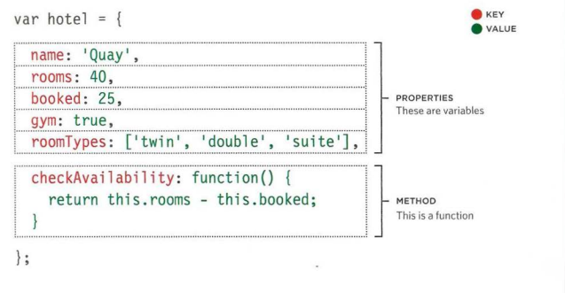
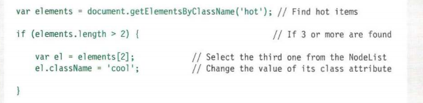
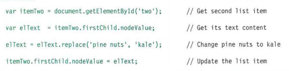

## Common hardest things about writing codes :

- Learning a new technology
- Naming things
- Testing your code
- Debugging
- Fixing bugs
- Making software maintainable

**the Protein Tracker application** is example for how to build simple application Very simple functionality, easily explainable, but most importantly, easily understood.

 the focus was taken off of the problem domain and put instead on the technology.

 ### Why problem domains are hard?

  is because you can’t really see what you are trying to build very clearly. Normally when you put together ajigsaw puzzle you follow steps that might look something like this:
  1. Figure out what the major components of the picture are
  2. Sort the pieces by color or component
  3. Put together all the border pieces
  4. Put together each component of the picture from the piles you created

  This all breaks down when you don’t have a picture with clear components that you can identify.

The same thing happens when ***writing code***. Writing code is a lot like putting together a jigsaw puzzle.  We put together code with the purpose of building components that we have taken out of the “bigger picture” of the problem domain.

If understanding the problem domain is the hardest part of programming and you want to make programming easier, you can do one of two things:

- Make the problem domain easier
- Get better at understanding the problem domain

## Objects 

Objects group together a set of variables and functions to create a model of a something you would recognize from the real world. In an object, variables and functions take on new names.

If a `variable` is part of an  object, it is called a `property`.
If a `function` is part of an object, it is called a `method`.

### Document Object Model

The Document Object Model (DOM) specifies how browsers should create a model of an HTML page and how JavaScript can access and update the contents of a web page while it is in the browser window.

**THE DOM TREE IS A MODEL OF A WEB PAGE** As a browser loads a web page, it creates a model of that page. The model is called a DOM tree, and it is stored in the browsers' memory. It consists of four main types of nodes. 
- THE DOCUMENT NODE
- ELEMENT NODES 
- ATTRIBUTE NODES 
- TEXT NODES 

Accessing and updating the DOM tree involves two steps: 
1. Locate the node that represents the element you want to work with. : SELECT AN INDIVIDUAL ELEMENT NODE,SELECT MULTIPLE ELEMENTS (NODELISTS) and TRAVERSING BETWEEN ELEMENT NODES 
2. Use its text content, child elements, and attributes.

**DOM QUERIES THAT RETURN MORE THAN ONE ELEMENT**
A Nodelist is a collection of element nodes. Each node is given an index number (a number that starts at zero, just like an array). 

When a DOM query returns a Nodelist, you may 
want to: 
- Select one element from the NodeList. 
- Loop through each item in the Nodelist and perform the same statements on each of the element nodes. 

There are two ways to select an element from a Nodelist: 
The item() method and array syntax. 
Both require the index number of the element you want. 

**LOOPING THROUGH A NODELIST**

If you want to apply the same code to numerous elements looping through a Nodelist is a powerful technique. 

**WHITESPACE NODES**

Traversing the DOM can be difficult because some browsers add a text node whenever they come across whitespace between elements.Most browsers, except IE, treat whitespace between elements (such as spaces or carriage returns) as a text node.

***FlRST & LAST CHILD***

These properties also return 
inconsistent results if there is whitespace between elements. In this example, a slightly different solution is used in the HTML - the closing tags are put next to the opening tags of the next element, making it a little more readable. 

*ACCESSING & CHANGING A TEXT NODE* 

To work with text in an element, first the element node is accessed and then its text node. The text node has a property called node Value which returns the text in that text node. 

