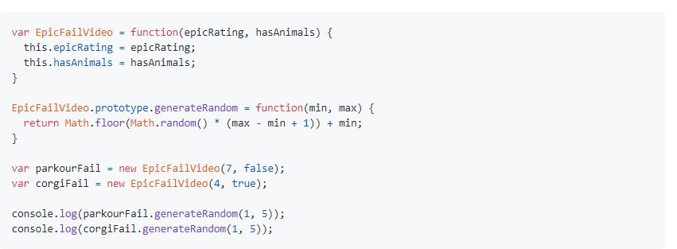
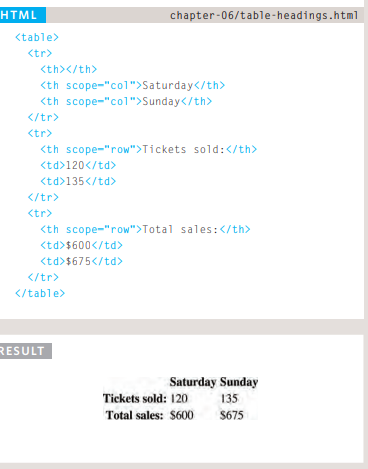
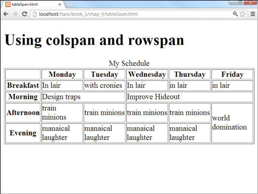

### Domain Modeling

Domain modeling is the process of creating a conceptual model in code for a specific problem. A model describes the various entities, their attributes and behaviors, as well as the constraints that govern the problem domain. An entity that stores data in properties and encapsulates behaviors in methods is commonly referred to as an object-oriented model.

### a constructor and initialize properties

To define the same properties between many objects, you'll want to use a constructor function. 

`EpicFailVideo` codes :

var EpicFailVideo = function(epicRating, hasAnimals) {

  this.epicRating = epicRating;

  this.hasAnimals = hasAnimals;

}

var parkourFail = new EpicFailVideo(7, false);

var corgiFail = new EpicFailVideo(4, true);

console.log(parkourFail);

console.log(corgiFail);

As you can see, the constructor function is defined using a function expression. In other words, the variable EpicFailVideo is declared and then assigned a function with two parameters called epicRating and hasAnimals.

When the function is called, the data inside these parameters are stored inside the this.epicRating and this.hasAnimals properties respectively. Storing data within properties ensures any newly created object can access that data later.

After the constructor function definition, two objects are instantiated with the new keyword and their properties are initialized by calling the EpicFailVideo constructor function. After being instantiated and initialized, these objects are stored inside the parkourFail and corgiFail variables.

Finally, the two newly created objects are logged to the console.

**Generate random numbers**

o model the random nature of user behavior, you'll need the help of a random number generator. Fortunately, the JavaScript standard library includes a `Math.random() `function for just this sort of occasion.

 

- When modeling a single entity that'll have many instances, build self-contained objects with the same attributes and behaviors.

- Model its attributes with a constructor function that defines and initializes properties.

- Model its behaviors with small methods that focus on doing one job well.

- Create instances using the new keyword followed by a call to a constructor function.

- Store the newly created object in a variable so you can access its properties and methods from outside.

- Use the this variable within methods so you can access the object's properties and methods from inside.

## Table 

A table represents information in a grid format. Examples of tables include financial reports, TV schedules, and sports results.

The <table> element is used 
to create a table. The contents of the table are written out row by row.

You indicate the start of each 
row using the opening < tr > tag.(The tr stands for table row.)

Each cell of a table is represented using a < td > element.(The td stands for table data.)

**Table Headings**

The < th > element is used just like the< td >element but its purpose is to represent the heading for either a column or a row. (The th stands for table heading.) Even if a cell has no content, you should still use a < td > or < th > element to represent the presence of an empty cell otherwise the table will not 
in the first row of this example shows an empty cell.) Using <th> elements for headings helps people who use screen readers, improves the ability for search engines to index your pages, and also enables you tocontrol the appearance of tables better when you start to use CSS.

**Spanning ColumnS**

The colspan attribute can be used on a < th > or < td > element and indicates how many columns that cell should run across.In the example on the right you can see a timetable with five columns; the first column contains the heading for that row (the day), the remaining four represent one hour time slots.If you look at the table cell that contains the words 'Geography' you will see that the value of the colspan attribute is 2, which indicates that the cell should run across two columns. In the third row, 'Gym' runs across three columns
 
 

 **Long Tables**

 `< thead >`
The headings of the table should 
sit inside the < thead > element. 

`< tbody >`
The body should sit inside the 
<tbody> element. 

`< tfoot >`
The footer belongs inside the 
< tfoot > element

## Constructr notation

To get a better idea of why you might want to create multiple objects on the same page, here is an example that shows room availability in two hotels. First, a constructor function defines a template for the hotels. Next, two different instances of this type of hotel object are created. The first represents a hotel called Quay and the second a hotel called Park. 

**LITERAL NOTATION** 
var hotel = {} 

hotel .name= 'Quay'; 
hotel .rooms = 40; 

hotel.booked = 25; 

hotel.checkAvailabil ity =function()

return this.rooms - this .booked; 
} ;

**OBJECT CONSTRUCTOR NOTATION**

var hotel = new Object(); 

hotel.name = 'Quay'; 

hotel .rooms = 40; 

hotel . booked= 25; 

hotel.checkAvailability =function() 
return this .rooms - this.booked; 
} ;

***STORING DATA***

In JavaScript, data is represented using name/value pairs. 
To organize your data, you can use an array or object to group a set of related values. In arrays and objects the name is also known as a key.

*VARIABLES*

A variable has just one key (the variable name) 
and one value.
var hotel= 'Quay' ; 

*ARRAYS*

Arrays can store multiple pieces of information. 
Each piece of information is separated by a comma. 
The order of the values is important because items 
in an array are assigned a number (called an index). 

var hotel s = [ 

' Quay ' , 

' Park' , 

' Beach' , 

'Bloomsbury'