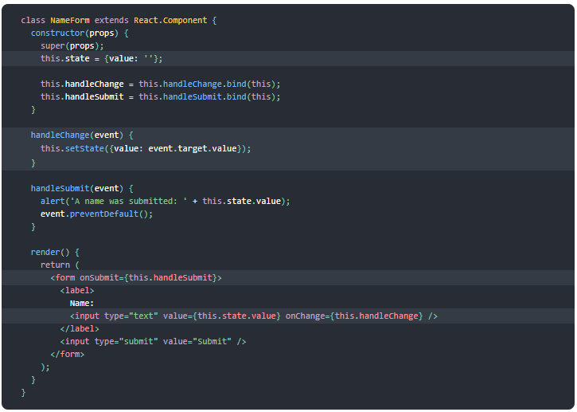

## Forms

The form has the default HTML form behavior of browsing to a new page when the user submits the form. If you want this behavior in React, it just works. But in most cases, it’s convenient to have a JavaScript function that handles the submission of the form and has access to the data that the user entered into the form. The standard way to achieve this is with a technique called “controlled components”.

### What is a ‘Controlled Component’?

In HTML, form elements such as < input>, < textarea >, and < select> typically maintain their own state and update it based on user input. In React, mutable state is typically kept in the state property of components, and only updated with setState().

We can combine the two by making the React state be the “single source of truth”. Then the React component that renders a form also controls what happens in that form on subsequent user input. An input form element whose value is controlled by React in this way is called a “controlled component”.

For example, if we want to make the previous example log the name when it is submitted, we can write the form as a controlled component:

-With a controlled component, the input’s value is always driven by the React state. While this means you have to type a bit more code, you can now pass the value to other UI elements too, or reset it from other event handlers.

-In HTML, an `<input type="file">` lets the user choose one or more files from their device storage to be uploaded to a server or manipulated by JavaScript via the File API.

`<input type="file" />`
Because its value is read-only, it is an uncontrolled component in React. It is discussed together with other uncontrolled components later in the documentation.

## ternary operator

### Why would we use a ternary operator?

to simplify your if-else statements that are used to assign values to variables. 

X===Y ? console.log(true) : console.log(false)