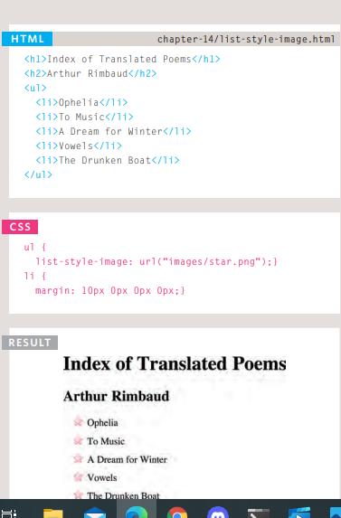

#Forms 

HTML borrows the concept of a form to refer to different 
elements that allow you to collect information from visitors to your siteThe best known form on the web is probably the search box that sits right in the middle of 
Google's homepage.

**Form Controls**
- ADDING TEXT:
1. ***Text input*** :The < input > element is used 
to create several different form 
controls. The value of the type
attribute determines what kind 
of input they will be creating.

type="text"
When the type attribute has a 
value of text, it creates a single line text input
name
When users enter information 
into a form, the server needs to 
know which form control each 
piece of data was entered into. 
(For example, in a login form, the 
server needs to know what has 
been entered as the username 
and what has been given as the 
password.) Therefore, each form 
control requires a name attribute. 
The value of this attribute 
identifies the form control and is 
sent along with the information 
they enter to the server.

2. ***Password input*** : < input >
type="password"
When the type attribute has 
a value of password it creates 
a text box that acts just like a 
single-line text input, except 
the characters are blocked out. 
They are hidden in this way so 
that if someone is looking over 
the user's shoulder, they cannot 
see sensitive data such as 
passwords.
name
The name attribute indicates 
the name of the password input, 
which is sent to the server with 
the password the user enters.
size, maxlength
It can also carry the size and 
maxlength attributes like the 
the single-line text input

3.***Text area*** : The < textarea > element 
is used to create a mutli-line 
text input. Unlike other input 
elements this is not an empty 
element. It should therefore have 
an opening and a closing tag. 

- Making Choices:
1.**Radio buttons** :type="radio"
Radio buttons allow users to pick 
just one of a number of options.
name
The name attribute is sent to 
the server with the value of the 
option the user selects. When 
a question provides users with 
options for answers in the form 
of radio buttons, the value of 
the name attribute should be the 
same for all of the radio buttons 
used to answer that question.
value
The value attribute indicates 
the value that is sent to the 
server for the selected option. 
The value of each of the buttons 
in a group should be different 
(so that the server knows which 
option the user has selected)
2.**Checkboxes**
3.Drop-down boxes 

- Submitting Forms:
1. Submit buttons
2. Image buttons

- Uploading Files: File upload

`< form >` Form controls live inside a 
< form > element. This element 
should always carry the action
attribute and will usually have a 
method and id attribute too.
action
Every `< form >` element requires 
an action attribute. Its value
is the URL for the page on the 
server that will receive the information in the form when it is submitted.methodForms can be sent using one of two methods: get or post.With the get method, the values from the form are added to the end of the URL specified in the action attribute

**DATE INPUT** : < input >
Many forms need to gather 
information such as dates, email 
addresses, and URLs. This has 
traditionally been done using 
text inputs.
HTML5 introduces new form 
controls to standardize the 
way that some information is 
gathered. Older browsers that 
do not recognize these inputs 
will just treat them as a single 
line text box. 
type="date"
If you are asking the user for a 
date, you can use an < input >
element and give the type
attribute a value of date. 
This will create a date input in 
browsers that support the new 
HMTL5 input types. 

### Lists, Tables and Forms

**Bullet Point Styles**
- Unordered Lists
- Ordered Lists

**list-style-image** 

**Gaps Between Cells** :
border-spacing, border-collapse

### Styling Forms

***Styling Text Inputs***

**font-size** sets the size of the text entered by the user.color sets the text color, and 
**background-color** sets the background color of the input.
**border** adds a border around the edge of the input box, and
***border-radius*** can be used to create rounded corners (for browsers that support this property)

## EVENTS

1. UIEVENTS : load ,unload,error and resize and scroll 
2.MOUSE EVENTS : clic; ,dclick ,mousdown and mouseup

HOW EVENTS TRIGGER JAVASCRIPT CODE ?
1. Select t he element node(s) you want the script to respond to.
2. Indicate which event on the selected node(s) will trigger the response. 
3. State the code you want to run when the event occurs. 

TRADITIONAL DOM EVENT HANDLERS :All modern browsers understand this way of creating an event handler, but you can only attach one function to each event handler. 

#### EVENT LISTENERS 
Event listeners are a more recent approach to handling events. 
They can deal with more than one function at a time 
but they are not supported in older browsers. 
