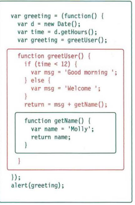

## Error Handling & Debugging

**ORDER OF EXECUTION** :

To find the source of an error, it helps to know how scripts are processed. 
The order in which statements are executed can be complex; some tasks 
cannot complete until another statement or function has been run

### EXECUTION CONTEXTS

The JavaScript interpreter uses the concept of execution contexts.there is one global execution context; plus, each function creates a new new execution context. They correspond to variable scope. 

Every statement in a script lives in one of three 
execution contexts: 
- GLOBAL CONTEXT 
- FUNCTION CONTEXT
- EVAL CONTEXT (NOT SHOWN)

**VARIABLE SCOPE** The first two execution contexts correspond with the notion of scope
- GLOBAL SCOPE
- FUNCTION-LEVEL SCOPE

### UNDERSTANDING SCOPE

In the interpreter, each execution context has its own va ri ables object. It holds the variables, functions, and parameters available within it. Each execution context can also access its parent's variables object. 

**UNDERSTANDING ERRORS** 

If a JavaScript statement generates an error, then it throws an exception. At that point, the interpreter stops and looks for exception-handl ing code. If you are anticipating that something in your code May cause an error, you can use a set of statements to handle the error (you meet them on p480). This is important because if the error is not handled, the script will just stop processing and the user will not know why. So exception-handling code should inform users when there is a problem. 

### HOW TO DEAL WITH ERRORS

1. **DEBUG THE SCRIPT TO FIX ERRORS** :If you come across an error while writing a script (or when someone reports a bug), you will need to debug the code, track down the source of the error, and fix it. 

2. **HANDLE ERRORS GRACEFULLY****  : You can handle errors gracefully using try, catch, throw, and f i na 1 ly statements

#### TYPING IN THE CONSOLE 
You can also just type code into the console and it will show you a result.
