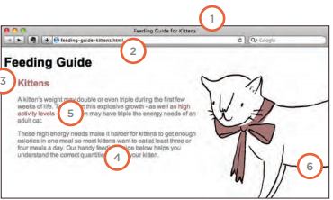

## IMAGES

Controlling the size and alignment of your images using CSS keeps rules that affect the presentation of your page in the CSS and out of the HTML markup.

**Controlling sizes of images in CSS** :
You can control the size of an image using the width and height properties in CSS, just like you can for any other box. Specifying image sizes helps pages to load more smoothly because the HTML and CSS code will often load before the images, and telling the browser how much space to leave for an image allows it to render the rest of the page without waiting for the image to download.

**Aligning images in css**

- ***The float property*** is added to the class that was created to represent the size of the image .

- ***New classes*** are created with names such as align-left or align-right to align the images to the left or right of the page. These class names are used in addition to classes that indicate the size of the image

Centering images : 
1. On the containing element, you can use the text-align property with a value of center.

2. On the image itself, you can use the use the margin property and set the values of the left and right margins to auto

**How insert background image in CSS ?** 

#### shorthand background

The background property acts like a shorthand for all of the other background properties you have just seen, and also the background-color property.The properties must be specified in the following order, but you can miss any value if you do not want to specify it.
1. background-color
2. background-image
3. background-repeat
4. background-attachment
5. background-position
CSS3 will also support the use of multiple background images by repeating the background shorthand. Because few browsers supported this property at the time of writing, it was not commonly used.
div {
 background:
 url(example-1.jpg)
 top left no-repeat,
 url(example-2.jpg) 
 bottom left no-repeat, 
 url(example-3.jpg) 
 centre top repeat-x;

 

 ## Practical Information

 ***Search Engine Optimization*** `<SEO>`: SEO is a huge topic and several books have been written on the subject. The following pages will help you understand the key concepts so you can improve your website's visibility on search engines.
 
 - The Basics :Search engine optimization (or 
SEO) is the practice of trying to help your site appear nearer the top of search engine results when people look for the topics that your website covers.

- On-Page Techniques:On-page techniques are the Methods you can use on your web pages to improve their rating in search engines.
- Off-Page Techniques: Getting other sites to link to you is just as important as on-page techniques. Search engines help determine how to rank your site by looking at the number of other sites that link to yours.

In every page of your website there are seven key places where keywords (the words people might search on to find your site) can appear in order to improve its findability.

1. Page Title
2. URL / Web Address
3. Headings
4. Text
5. Link Text
6. Image Alt Text
7. Page Descriptions

##How to Identify Keywords and Phrases?
Determining which keywords to use on your site can be one of the hardest tasks when you start to think about SEO. Here are six steps that will help you identify the right keywords and phrases for your site.
- Brainstorm
- Organize
- Research

####Flash, Video & Audio

***How Flash Works?*** 
Whether you are creating an animation or a media player in Flash, the files you put on your website are referred to as Flash movies. If you want to create your own Flash movie, you need to purchase the Flash authoring environment from Adobe.
