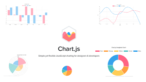
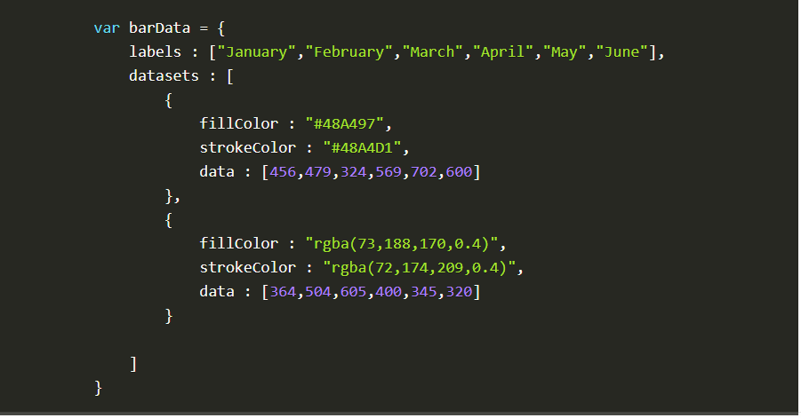
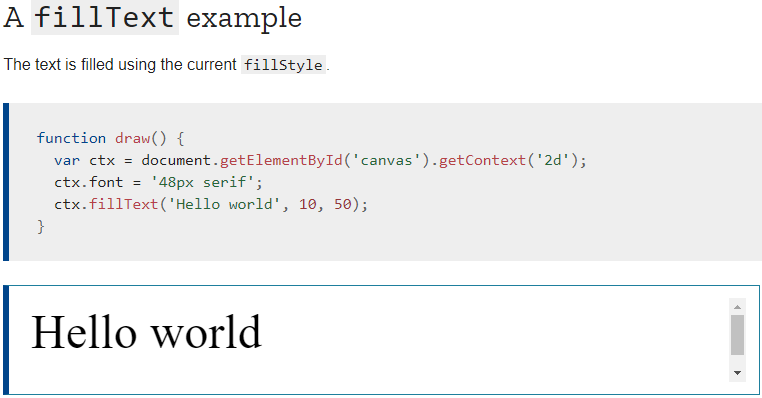

## CHART.JS

A great way to get started with charts is with Chart.js, a JavaScript plugin that uses HTML5’s canvas element to draw the graph onto the page. It’s a well documented plugin that makes using all kinds of bar charts, line charts, pie charts and more, incredibly easy.

**Drawing a line chart**
To draw a line chart, the first thing we need to do is create a canvas element in our HTML in which Chart.js can draw our chart. So add this to the body of our HTML page:
1. `< canvas id="buyers" width="600" height="400"></canvas  >`

2. < script >
    var buyers = document.getElementById('buyers').getContext('2d');
    new Chart(buyers).Line(buyerData);
< /script >
**Drawing a pie chart**

**Drawing a bar chart**

To learn more about chart click [here](https://www.webdesignerdepot.com/2013/11/easily-create-stunning-animated-charts-with-chart-js/)

**The grid**

Before we can start drawing, we need to talk about the canvas grid or coordinatespace. Our HTML skeleton from the previous page had a canvas element 150 pixels wide and 150 pixels high.

**Drawing rectangles**

Unlike SVG, `< canvas >` only supports two primitive shapes: rectangles and paths (lists of points connected by lines). All other shapes must be created by combining one or more paths. Luckily, we have an assortment of path drawing functions which make it possible to compose very complex shapes.

First let's look at the rectangle. There are three functions that draw rectangles on the canvas:
- fillRect(x, y, width, height) : Draws a filled rectangle.

- strokeRect(x, y, width, height) :Draws a rectangular outline.
- clearRect(x, y, width, height) :Clears the specified rectangular area, making it fully transparent.

click [here](https://developer.mozilla.org/en-US/docs/Web/API/Canvas_API/Tutorial/Draw) to learn more about shape.

Up until now we have only seen methods of the drawing context. If we want to apply colors to a shape, there are two important properties we can use: **fillStyle** and **strokeStyle**.

## Drawing text

The canvas rendering context provides two methods to render text:

- fillText(text, x, y [, maxWidth])
- strokeText(text, x, y [, maxWidth])

**Styling text**

- `font = value` 
The current text style being used when drawing text. This string uses the same syntax as the CSS font property. The default font is 10px sans-serif.

- `textAlign = value`
Text alignment setting. Possible values: start, end, left, right or center. The default value is start.

- `textBaseline = value`

Baseline alignment setting. Possible values: top, hanging, middle, alphabetic, ideographic, bottom. The default value is alphabetic.