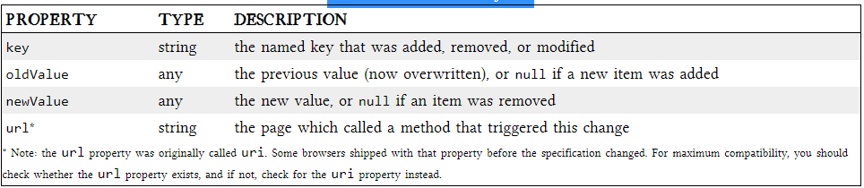

## The Past, Present, and Future of Local Storage for Web Applications

Persistent local storage is one of the areas where native client applications have held an advantage over web applications. For native applications, the operating system typically provides an abstraction layer for storing and retrieving application-specific data like preferences or runtime state. These values may be stored in the registry, INI files, XML files, or some other place according to platform convention. If your native client application needs local storage beyond key/value pairs, you can embed your own database, invent your own file format, or any number of other solutions.

persistent local storage of small amounts of data but have three potentially dealbreaking downsides:

- Cookies are included with every HTTP request, thereby slowing down your web application by needlessly transmitting the same data over and over

- Cookies are included with every HTTP request, thereby sending data unencrypted over the internet (unless your entire web application is served over SSL)
 - Cookies are limited to about 4 KB of data — enough to slow down your application (see above), but not enough to be terribly useful.

 ### Before Html :
 In the beginning, there was only Internet Explorer. Or at least, that’s what Microsoft wanted the world to think. To that end, as part of the First Great Browser Wars, Microsoft invented a great many things and included them in their browser-to-end-all-browser-wars, Internet Explorer. One of these things was called DHTML Behaviors, and one of these behaviors was called userData.

 ## HTML5 STORAGE

 is a specification named Web Storage, which was at one time part of the HTML5 specification proper, but was split out into its own specification for uninteresting political reasons. Certain browser vendors also refer to it as “Local Storage” or “DOM Storage.” The naming situation is made even more complicated by some related, similarly-named, emerging standards that I’ll discuss later in this chapter.it’s a way for web pages to store named key/value pairs locally, within the client web browser. Like cookies, this data persists even after you navigate away from the web site, close your browser tab, exit your browser, or what have you.

 

 **to check for HTML5 Storage by using this code:**

unction supports_html5_storage() {
  try {
    return 'localStorage' in window && window['localStorage'] !== null;
  } catch (e) {
    return false;
  }
}

**STORAGEEVENT OBJECT**
The storage event is not cancelable. From within the handle_storage callback function, there is no way to stop the change from occurring. It’s simply a way for the browser to tell you, “hey, this just happened. There’s nothing you can do about it now; I just wanted to let you know.”

