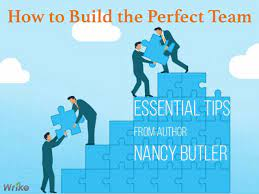

###  Build the Perfect Team
Building a successful team is about more than finding a group of people with the right mix of professional skills. Over the course of interviewing over 500 leaders for Corner Office, I asked them all about the art of fostering a strong sense of teamwork. Their insights can help you lay the groundwork for a highly productive team that can communicate, cooperate and innovate in an atmosphere of mutual trust and respect.

Team A is composed of people who are all exceptionally smart and successful. When you watch a video of this group working, you see professionals who wait until a topic arises in which they are expert, and then they speak at length, explaining what the group ought to do. When someone makes a side comment, the speaker stops, reminds everyone of the agenda and pushes the meeting back on track. This team is efficient. There is no idle chitchat or long debates. The meeting ends as scheduled and disbands so everyone can get back to their desks.

**Our data-saturated age**

 enables us to examine our work habits and office quirks with a scrutiny that our cubicle-bound forebears could only dream of. Today, on corporate campuses and within university laboratories, psychologists, sociologists and statisticians are devoting themselves to studying everything from team composition to email patterns in order to figure out how to make employees into faster, better and more productive versions of themselves. 
 

 ## CSS Transforms

With CSS3 came new ways to position and alter elements. Now general layout techniques can be revisited with alternative ways to size, position, and change elements. All of these new techniques are made possible by the transform property.

The transform property comes in two different settings, two-dimensional and three-dimensional. Each of these come with their own individual properties and values

#### Transform Syntax

The actual syntax for the transform property is quite simple, including the transform property followed by the value. The value specifies the transform type followed by a specific amount inside parentheses.

- 2D Rotate
- 2D Scale
- 2D Translate
- 2D Skew

**Combining Transforms**

It is common for multiple transforms to be used at once, rotating and scaling the size of an element at the same time for example. In this event multiple transforms can be combined together. To combine transforms, list the transform values within the transform property one after the other without the use of commas.

Using multiple transform declarations will not work, as each declaration will overwrite the one above it. The behavior in that case would be the same as if you were to set the height of an element numerous times.

to read more about CSS Transforms click [here !](https://learn.shayhowe.com/advanced-html-css/css-transforms/)

### Transitions & Animations

As mentioned, for a transition to take place, an element must have a change in state, and different styles must be identified for each state. The easiest way for determining styles for different states is by using the :`hover`, :`focus`, :`active`, and :`target pseudo-classes`.

**Transitional Property**

The transition-property property determines exactly what properties will be altered in conjunction with the other transitional properties. By default, all of the properties within an element’s different states will be altered upon change. However, only the properties identified within the transition-property value will be affected by any transitions. 

this codes for example :

.box {
    background: #2db34a;
    border-radius: 6px
    transition-property: background, border-radius;
    transition-duration: 1s;
    transition-timing-function: linear;
  }
  .box:hover {
    background: #ff7b29;
    border-radius: 50%;
  }

#### How TRANSITIONS THAT WILL WOW YOUR USERS ?

1. Fade in
2. Change color
3. Grow & Shrink
4. Rotate elements
5. Square to circle
6. 3D shadow
7. Swing
8. Inset border