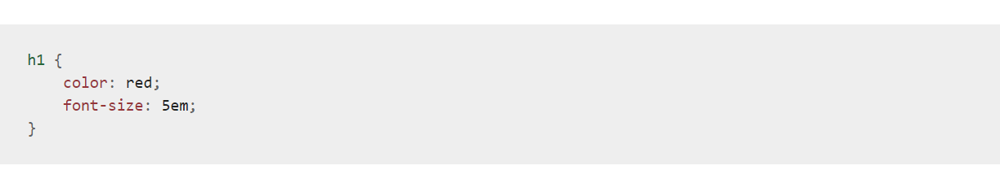

# Definition of CSS :

**CSS** is a language for specifying how documents are presented to users and to create great-looking web pages and  can be used for very basic document text styling — for example changing the color and size of headings and links

CSS is a rule-based language — you define rules specifying groups of styles that should be applied to particular elements or groups of elements on your web page. For example "I want the main heading on my page to be shown as large red text."

## What Ways to Insert CSS ?

- **External CSS** : external css file we have to link it to our html
- **Internal CSS** :An internal style sheet may be used if one single HTML page has a unique style.
- **Inline CSS** :use inline styles, add the style attribute to the relevant element. The style attribute can contain any CSS property.