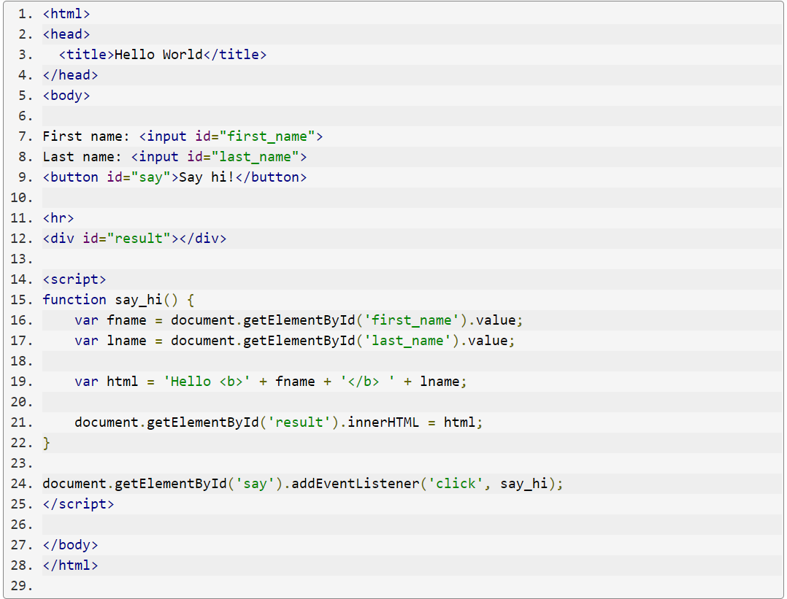
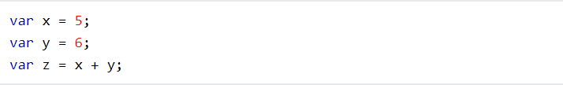

# What is JavaScript ?

JavaScript (**JS**) is a lightweight, interpreted, or just-in-time compiled programming language with first-class functions. While it is most well-known as the scripting language for Web pages, many non-browser environments also use it, such as Node.js, Apache CouchDB and Adobe Acrobat. JavaScript is a prototype-based, multi-paradigm, single-threaded, dynamic language, supporting object-oriented, imperative, and declarative (e.g. functional programming) styles .

Read more about [JavaScript.](https://developer.mozilla.org/en-US/docs/Web/JavaScript)

### The standards for JavaScript are: 
-  the ECMAScript Language Specification (**ECMA-262**) 
- the ECMAScript Internbeginners ,Intermediate or Advanced [click here](https://developer.mozilla.org/en-US/docs/Web/JavaScript#tutorials)ationalization API specification (**ECMA-402**)

### to Learn how to program in JavaScript with guides and tutorials whether you are beginners ,Intermediate or Advanced [click here.](https://developer.mozilla.org/en-US/docs/Web/JavaScript#tutorials)

To link JS with HTML using 

</body>

##  Example for JavaScript Variables :

To read more about other variables click [here!](https://www.w3schools.com/js/js_variables.asp)

