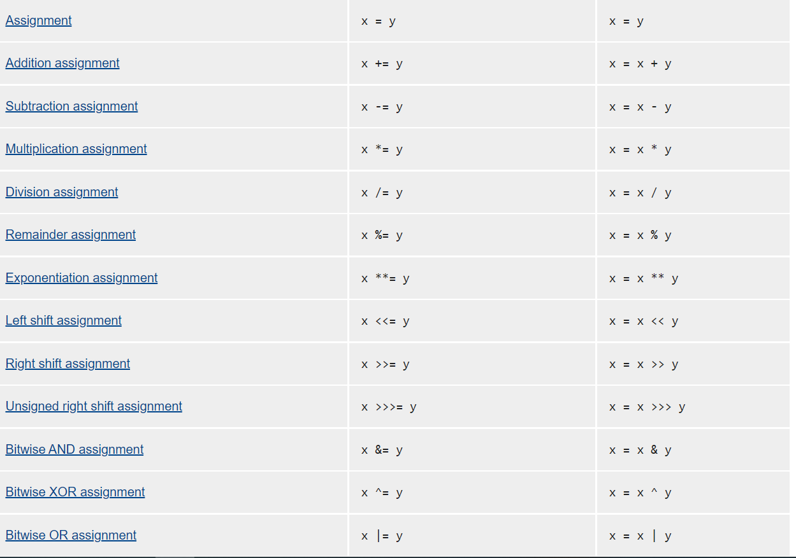
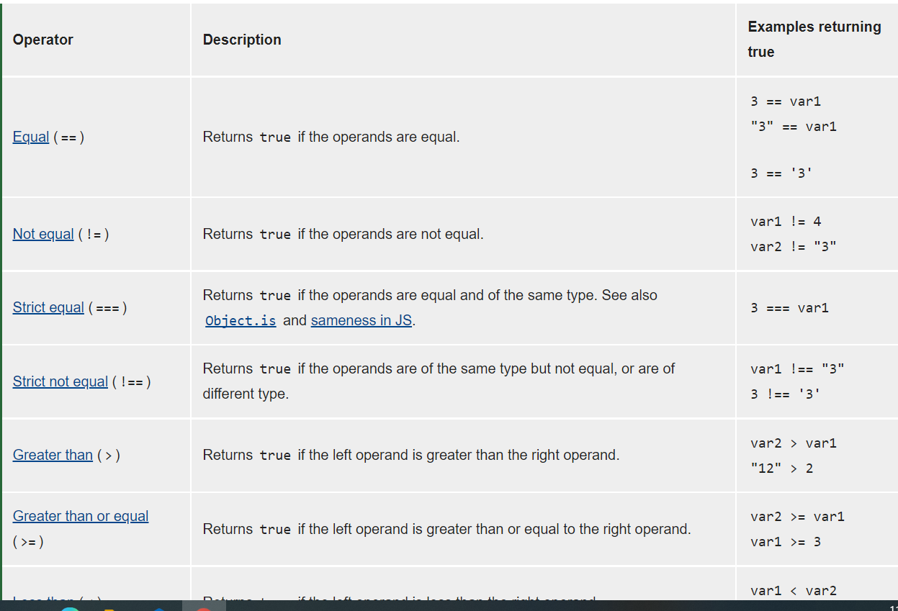
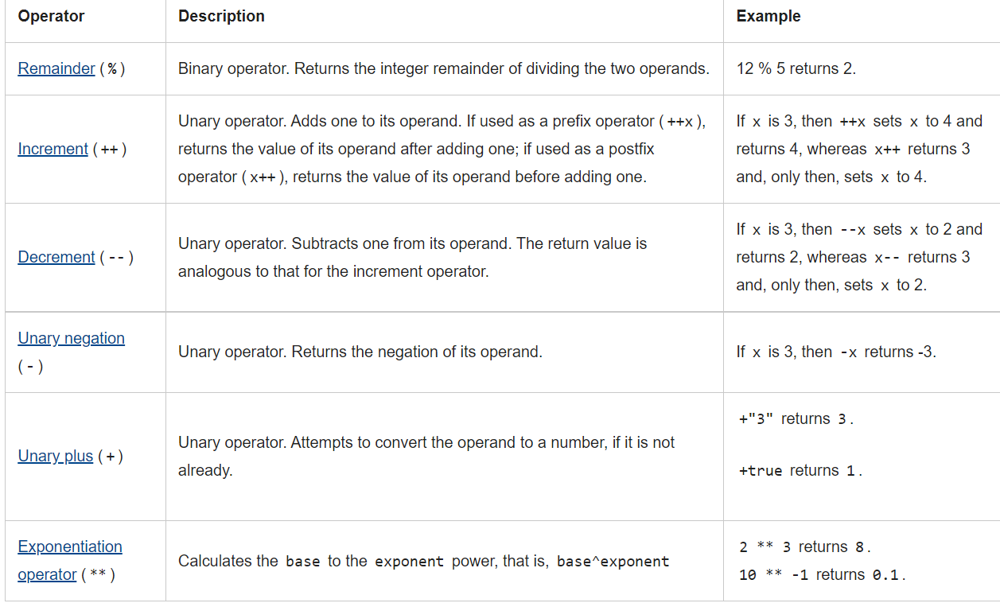

# JavaScript

JavaScript (JS) is a lightweight, interpreted, or just-in-time compiled programming language with first-class functions. While it is most well-known as the scripting language for Web pages, many non-browser environments also use it, such as Node.js, Apache CouchDB and Adobe Acrobat. JavaScript is a prototype-based, multi-paradigm, single-threaded, dynamic language, supporting object-oriented, imperative, and declarative (e.g. functional programming) styles .

## **Types of operators for JavaScript :**

* **Assignment operators** : An assignment operator assigns a value to its left operand based on the value of its right operand .

in this image examples for Assignment operators 

* **Comparison operators** : comparison operator compares its operands and returns a logical value based on whether the comparison is true .

in this image examples for comparison operators 

* **Arithmetic operators**

An arithmetic operator takes numerical values (either literals or variables) as their operands and returns a single numerical value.

to read about other operators click [here!](https://developer.mozilla.org/en-US/docs/Web/JavaScript/Guide/Expressions_and_Operators)

## Functions in JS

Functions are one of the fundamental building blocks in JavaScript. A function in JavaScript is similar to a procedure—a set of statements that performs a task or calculates a value, but for a procedure to qualify as a function, it should take some input and return an output where there is some obvious relationship between the input and the output. To use a function, you must define it somewhere in the scope from which you wish to call it.

### Control flow

The control flow is the order in which the computer executes statements in a script.

Code is run in order from the first line in the file to the last line, unless the computer runs across the (extremely frequent) structures that change the control flow, such as conditionals and loops. 

For example, imagine a script used to validate user data from a webpage form. The script submits validated data, but if the user, say, leaves a required field empty, the script prompts them to fill it in.

to read more about control flow click [here!](https://developer.mozilla.org/en-US/docs/Glossary/Control_flow)
