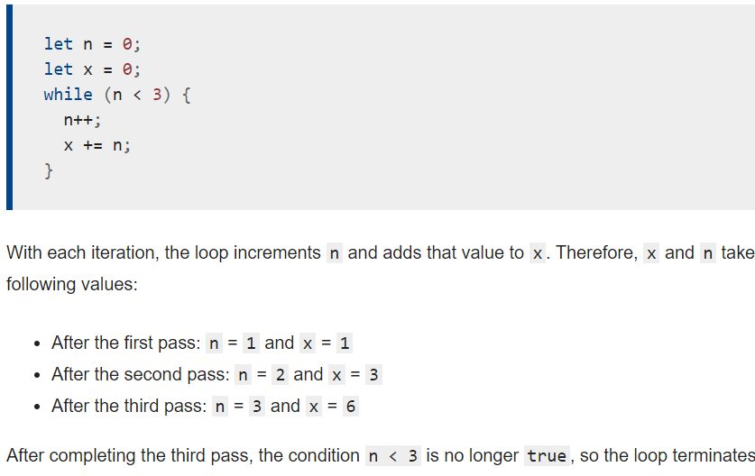

# LOOPS

Loops offer a quick and easy way to do something repeatedly. This chapter of the JavaScript Guide introduces the different iteration statements available to JavaScript.

**The statements for loops provided in JavaScript** :

1. *for statement* :A for loop repeats until a specified condition evaluates to false. The JavaScript for loop is similar to the Java and C for loop.

2. *while statement* :A while statement executes its statements as long as a specified condition evaluates to true

3. *labeled statement*
4. *break statement* : Use the break statement to terminate a loop, switch, or in conjunction with a labeled statement.

When you use break without a label, it terminates the innermost enclosing while, do-while, for, or switch immediately and transfers control to the following statement.
When you use break with a label, it terminates the specified labeled statement.
5. *continue statement*