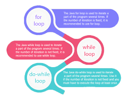

## Java Imports 

 Always the package is the sameas the folder name that contain java files and we use the name the packages by other libraries in order to using it.

 and following the optional package declaration, we can have import statements, which allow you to specify classes from other packages that can be referenced without qualifying them with their package.

**Package declaration syntax** in three steps :
1.Package statment .
2.Imports.
3.Class or interface definitions.

**this is Common imports:**
`import java.awt.*;	
import java.awt.event.*;	
import javax.swing.*;
import java.util.*;
import java.io.*;	
import java.text.*;	.
import java.util.regex.*;`	

to read more about imports and packages click [here!](https://perso.ensta-paris.fr/~diam/java/online/notes-java/language/10basics/import.html)

## Java Loops 
exist different types of loops to fit any programming need. Each loop has its own purpose and a suitable use case to serve.

**types of loops that we can find in Java:**
1.**for loop** :  A for loop it allows us to repeat certain operations by incrementing and evaluating a loop counter in limited numbers of repeats .

2.Enhanced for-each loop
3.**While loop** : It repeats a statement or a block of statements while its controlling Boolean-expression is true and not exist limited numbers of repeats.
4.**Do-While loop**:The do-while loop works just like the while loop except for the fact that the first condition evaluation happens after the first iteration of the loop.

to read more about loops click [here!](https://www.baeldung.com/java-loops)